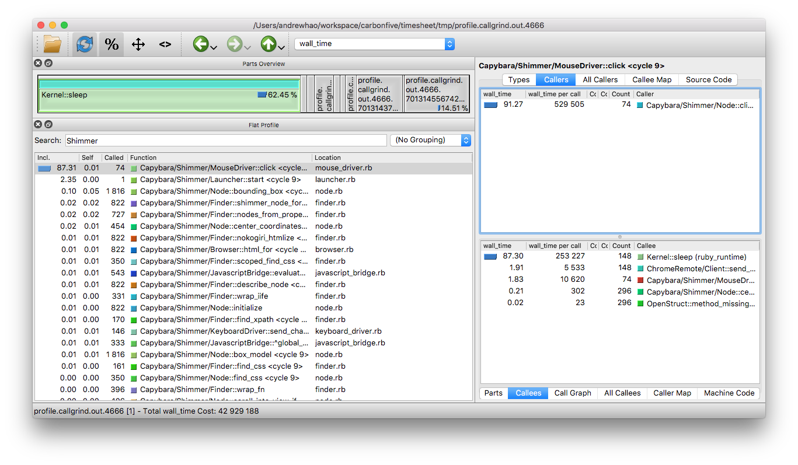

class: middle hide-slide-number

# Shimmer

#### A Capybara Chrome Driver That Ain't ChromeDriver


Andrew Hao [@andrewhao](https://www.twitter.com/andrewhao)


---

class: middle center

# What?

---

class: middle center

An internal Carbon Five spike to develop a faster alternative to Capybara headless Chrome

---

class: middle center

# Why?

---

class: middle center

Switching from Poltergeist to Headless Chrome was up to **2x** slower!

---

class: middle center

# Hypothesis

---

class: middle center

Capybara/Selenium/Chromedriver introduces unnecessary latency due to heavy abstractions.

---

## WebDriver protocol

A Selenium (and now W3C) protocol.

--

Synchronous.

---

## Chrome DevTools protocol

A socket-based, event-driven wire protocol built to control, inspect, and debug Chrome.

--

Asynchronous.

---

class: middle center

# Research

How does Capybara/Selenium/ChromeDriver work?

---

class: middle 

## ChromeDriver is an adapter between two protocols

```
+-----------+   +--------------------------+   +----------+
| Capybara  |   | WebDriver       DevTools |   | Chrome   |
| WebDriver |---| API             API      |---| Browser  |
+-----------+   +--------------------------+   +----------+
                        ChromeDriver
```

???

Capybara-Selenium hits the ChromeDriver server, which turns around and talks to Chrome which is listening on a socket.

---

class: middle center

# Build it!

a proof of concept driver

---

class: middle center

## Research [DevTools API](https://chromedevtools.github.io/devtools-protocol/)

Divided into **methods** (commands) and **events**

---

class: background-color-code

## `chrome_remote`, the DevTools wire protocol library

EventMachine-based wire protocol library, [chrome_remote](https://github.com/cavalle/chrome_remote)

```ruby
# Perform a query or command on the browser
chrome_client.send_cmd("DOM.describeNode", nodeId: node_id)

# Block execution until a specific event comes back
# over the wire
chrome_client.wait_for("Page.loadEventFired")
```

---

class: middle center

## What do you need to build a Capybara driver?

---

class: background-color-code

```ruby
# spec/support/capybara.rb

Capybara.register_driver :shimmer do |app|
  Capybara::Shimmer::Driver.new(app)
end

# If you want to run shimmer for all specs
Capybara.default_driver = :shimmer

# Only run shimmer for JS-based tests
Capybara.javascript_driver = :shimmer
```

---

class: middle center

## Read the [Capybara docs](http://www.rubydoc.info/github/teamcapybara/capybara/master)

---

## Learn by example:

Peruse the source of existing drivers:
   - [poltergeist](https://github.com/teampoltergeist/poltergeist)
   - [rack-test](https://github.com/teamcapybara/capybara/tree/master/lib/capybara/rack_test)
   - [capybara-selenium](https://github.com/teamcapybara/capybara/tree/master/lib/capybara/selenium) - and [selenium-webdriver](https://github.com/SeleniumHQ/selenium/tree/master/rb/lib)
   - [capybara-webkit](https://github.com/thoughtbot/capybara-webkit)
---

## `Capybara::Driver::Base`

Top-level representation of the active page (browser) context

* `#current_url`
* `#find_css`
* `#find_xpath`
* `#refresh`
* `#go_back`
* `#switch_window`

---

## `Capybara::Driver::Node`

The representation of a single DOM node.

* `#all_text`
* `#visible?`
* `#send_keys`
* `#set`
* `#value`
* `#click`

---

class: middle center

As long as you have your own driver-specific implementations of these two classes, you're set!

---

## How do you do things in DevTools?

Reverse engineer:

* [puppeteer](https://github.com/GoogleChrome/puppeteer/)
* [chromedriver](https://github.com/bayandin/chromedriver)

---

class: middle center

# How do I...

Navigate to a page?

---

class: background-color-code small-code middle

```js
async goto: (url) => {
  async function navigate(client, url, referrer) {
    const response = await client.send('Page.navigate', {url, referrer});
  }
  const watcher = new NavigatorWatcher(this._frameManager, mainFrame, timeout, options);
  const navigationPromise = watcher.navigationPromise();
  let error = await Promise.race([
    navigate(this._client, url, referrer),
    navigationPromise,
  ]);
}
```

---

class: middle center

## Now with Shimmer!

---

class: background-color-code small-code middle

```ruby
def visit(path)
  send_cmd "Page.navigate", url: path
  wait_for do |event_name, event_params|
    (event_name == "Page.loadEventFired") ||
      (event_name == "Page.lifecycleEvent" &&
        (event_params["name"] == "load" ||
          event_params["name"] == "networkIdle"))
  end
end
```

---

class: middle center

Bonus! DevTools *heavily* relies on the execution of Javascript from within the Chrome context

---

class: middle center

This is amazing and awesome if you are a Javascript-based runner (`puppeteer`).

---

class: middle center

# How do I...

Find an element?

---

class: background-color-code small-code

```js
async $$(selector) {
  const arrayHandle = await this.executionContext().evaluateHandle(
      (element, selector) => element.querySelectorAll(selector),
      this, selector
  );
  const properties = await arrayHandle.getProperties();
  await arrayHandle.dispose();
  const result = [];
  for (const property of properties.values()) {
    const elementHandle = property.asElement();
    if (elementHandle)
      result.push(elementHandle);
  }
  return result;
}
```
---

class: middle center

## Now with Shimmer!

---

class: background-color-code small-code

```ruby
def find_css(query)
  script = <<~JS
    (function(query, element) {
       element.querySelectorAll(query)
     })(#{query.inspect}, document)
  JS
  results = send_cmd("Runtime.evaluate",
                     expression: script)
  send_cmd("Runtime.getProperties", objectId: results.objectId)
    .map do |node_object_id|
      node_props = browser.send_cmd("DOM.describeNode", nodeId: node_id)
      Capybara::Shimmer::Node.new(node_props, ...)
    end
  end
end
```

---

class: middle

### Observations

* A lot of transitions between Ruby <> Wire <> Javascript
* Return calls over the wire have reference IDs into the JS execution context
* Must continue passing these references around
* Easy to get N+1 queries

---

## Implement a few Capybara APIs

These will actually get you pretty far:

* `Driver#visit`
* `Driver#find_css`
* `Driver#find_xpath`
* `Driver#evaluate_script`
* `Node#value`
* `Node#visible?`
* `Node#all_text`
* `Node#click`

---

class: background-color-code

## Spin up a benchmark

```ruby
Benchmark.ips do |x|
  x.warmup = 10
  x.time = 30

  %i[shimmer poltergeist headless_chrome].each do |driver|
    x.report(driver.to_s) {
      CapybaraExample.run(driver, fixture_server)
    }
  end

  x.compare!
end
```

---

## And the results are in!

```
Comparison:
    headless_shimmer:       18.9 i/s
             shimmer:        6.5 i/s - 2.89x  slower
         poltergeist:        6.3 i/s - 2.99x  slower
     headless_chrome:        2.3 i/s - 8.28x  slower
              chrome:        2.0 i/s - 9.52x  slower
```

---

class: middle center

# OMG SO FAST

---

class: middle center

## I'm Feeling Lucky

Let's try it on Timesheet

---

class: middle center

Get it working for a subset of tests, then compare the run times of the two.

---

class: middle center

# Annnd?

---

class: middle center

## :omg:

Shimmer is 25% *slower* than headless chrome!

---

class: middle center

But I thought it was supposed to be **3x faster**?

---

class: middle

### Learning

Synthetic benchmarks are only useful if they match real-world use cases!

---

class: middle center

Solution - update the benchmark to click around a lot more

---

class: middle center

## Debugging fun

Let's use `ruby-prof` and `qcachegrind` to profile our app!

---

class: middle center



---

class: middle center

## Wow that's a lot of `sleep`ing

---

class: middle center

Reduce the sleeps and run again

---

class: middle

## Much better:

Shimmer runs 32% **faster** than headless chrome!*

--

\* in Timesheet

---

class: middle center

## Warning! Rapidly-evolving API

Things break when new Chrome releases

---

### So... is Shimmer actually faster?

Tentatively - it seems so!

- It seems to run ~2x faster than Headless Chrome
- It runs in the same ballpark as Poltergeist

---

### Missing APIs

Shimmer still can't do some things like:

* Radio button/checkbox manipulation
* Introspect HTTP requests
* Cookie management
* Tab/frame switching
* Run on Windows

---

class: middle center

#### Maybe you can help?

Github: [carbonfive/shimmer](https://www.github.com/carbonfive/shimmer)

